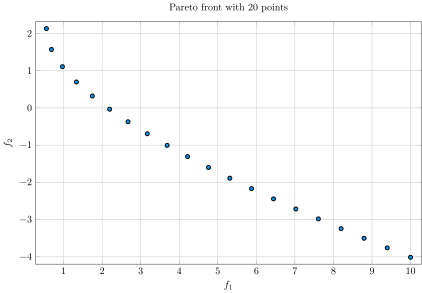

# MultiJuMP

[](https://travis-ci.org/anriseth/MultiJuMP.jl)

MultiJuMP enables the user to easily run multiobjective optimisation problems
and generate Pareto fronts. The code is built as an extension of
[https://github.com/JuliaOpt/JuMP.jl](JuMP).
We use the Normal Boundary Intersection method to trace out the Pareto front.


## Usage
Have a look in the `examples/` directory for different use cases, including
tri-objective Pareto fronts.
As a usage example, we implement the test from
_Das and Dennis, 1998: Normal-boundary intersection: A new method for
generating the Pareto surface in nonlinear multicriteria optimization problems_:

```julia
using MultiJuMP, JuMP
using Ipopt

m = MultiModel(solver = IpoptSolver())
@defVar(m, x[i=1:5])
@defNLExpr(m, f1, sum{x[i]^2, i=1:5})
@defNLExpr(m, f2, 3x[1]+2x[2]-x[3]/3+0.01*(x[4]-x[5])^3)
@addNLConstraint(m, x[1]+2x[2]-x[3]-0.5x[4]+x[5]==2)
@addNLConstraint(m, 4x[1]-2x[2]+0.8x[3]+0.6x[4]+0.5x[5]^2 == 0)
@addNLConstraint(m, sum{x[i]^2, i=1:5} <= 10)

iv1 = [0.3, 0.5, -0.26, -0.13, 0.28]
obj1 = SingleObjective(f1, sense = :Max,
                       iv = Dict{Symbol,Any}(:x => iv1))
obj2 = SingleObjective(f2, sense = :Min)

multim = getMultiData(m)
multim.objectives = [obj1, obj2]
multim.ninitial = 5
solve(m, method = :NBI)
```

Plot with Immerse.jl using ```nbi = plot(multim)```, or more generally:
```julia
f1arr = convert(Array{Float64}, [multim.paretofront[i][1] for i in 1:multim.ninitial])
f2arr = convert(Array{Float64}, [multim.paretofront[i][2] for i in 1:multim.ninitial])

nbi = plot(x=f1arr, y=f2arr, Geom.point,
           Guide.xlabel("f1"), Guide.ylabel("f2"))
```



##TODO:
- Add bounds on the MultiObjective type
    * So we can ask to only search over subset of pareto front
    * __This seems to be causing problems__
- Add objective `t` before the individual optimisations?
    * Then we can warm-start the NBI subproblems after the individual runs?
    * It seemed to cause an issue in revenue-profit optimisation,
    where including `t` caused the algorithm to find a worse, local optimum
- Add option to use inequality in NBI constraint?
- Do the plotting with Immerse?
- Tell travis to install Ipopt
- Create more tests (WS, 3 objectives)
- For 3 objectives or more: Make it possible to have different spacing in the
  components of $\beta$
